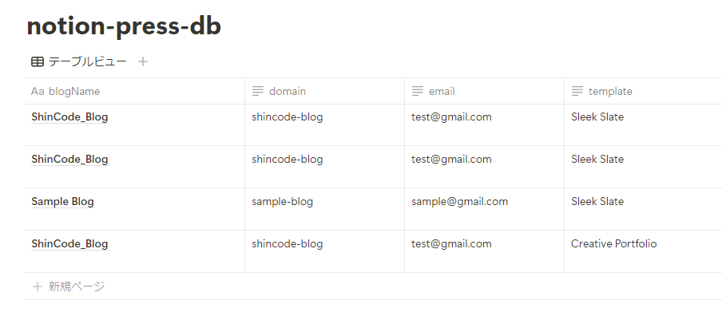

# notion-db-js

**⚠️ Warning: Package Under Development**

This package is currently in the development stage. Some features are limited or not yet implemented. It is not recommended for use in production environments.

---

`notion-db-js` is a JavaScript/TypeScript library designed to simplify interactions with Notion databases. This library abstracts the complexities of directly dealing with the Notion API, allowing for easier database operations.

## Current Implementation Status

✅ Implemented:

- Basic initialization
- Insert records (`insert()`)
- Full record selection (`select()`)

⏳ Not Yet Implemented:

- Column-specific selection
- Update operations
- Delete operations
- Filtering
- Sorting
- Pagination
- Full TypeScript support

## Installation

```bash
npm install notion-db-js
```

## Basic Usage

### Initialization

```javascript
import NotionDB from "notion-db-js";

// Recommended: Create a singleton instance
let notionDB: NotionDB | null = null;

async function initializeNotionDB() {
  if (!notionDB) {
    notionDB = new NotionDB(process.env.NOTION_INTEGRATION_TOKEN as string);
    await notionDB.initialize();
  }
  return notionDB;
}
```

### Fetching All Records

```javascript
const db = await initializeNotionDB();
const { data, error } = await db.from("your-database-name").select();

if (error) {
  console.error("Error fetching data:", error);
} else {
  console.log("Fetched data:", data);
}
```

### Creating a Record

```javascript
const db = await initializeNotionDB();
const newRecordId = await db.from("your-database-name").insert({
  title: "New Record",
  description: "This is a new record",
  status: "active",
});
```

## Next.js Integration Example

Here's a real-world example of using notion-db-js in a Next.js API route:

```typescript
// app/api/notion/db/route.ts
import { NextRequest, NextResponse } from "next/server";
import NotionDB from "notion-db-js";

let notionDB: NotionDB | null = null;

async function initializeNotionDB() {
  if (!notionDB) {
    notionDB = new NotionDB(process.env.NOTION_INTEGRATION_TOKEN as string);
    await notionDB.initialize();
  }
  return notionDB;
}

export async function POST(req: NextRequest) {
  const body = await req.json();

  try {
    const db = await initializeNotionDB();

    const { blogName, domain, email, template } = body;
    await db.from("notion-press-db").insert({
      blogName,
      domain,
      email,
      template,
    });

    return NextResponse.json(
      { success: true, message: "Databases initialized successfully" },
      { status: 200 }
    );
  } catch (error) {
    console.error(error);
    return NextResponse.json({
      message: "NotionDBへの保存に失敗しました。",
    });
  }
}
```

Using this code, you can save data to your Notion database as shown in the image below:



## Architecture Overview

The diagram above illustrates how notion-db-js acts as a bridge between your Next.js application and the Notion API, simplifying database operations.

## Known Limitations

- Currently only supports full table selection (no column-specific selection)
- Update and delete operations are not yet implemented
- TypeScript support is limited
- No filtering or sorting capabilities yet
- Basic error handling only

## Contributing

Bug reports and feature requests are welcome on GitHub Issues. Pull requests are also welcome.

## License

This project is released under the MIT License. See the [LICENSE](LICENSE) file for details.

## Author

ShinCode

---

If you have any questions or need support, please open an issue on [GitHub Issues](link-to-github-issues).
